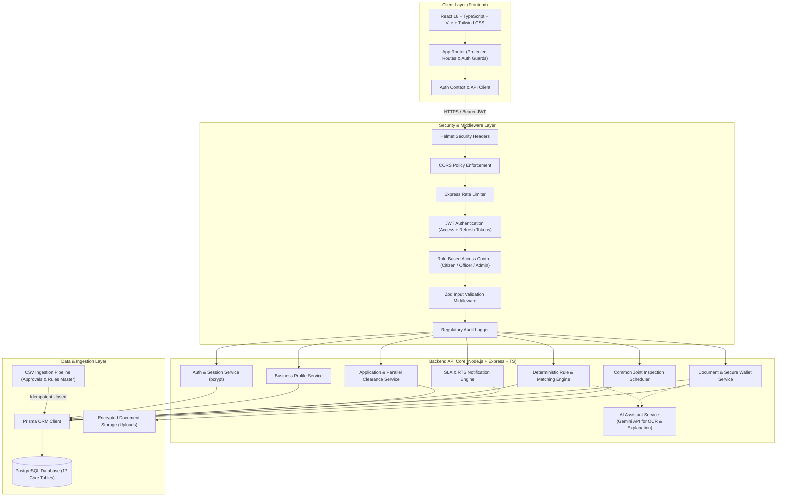
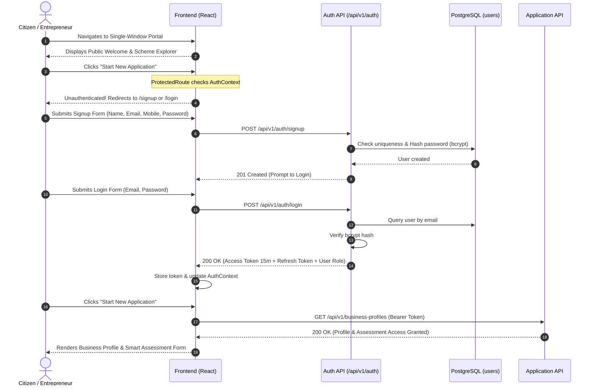

# System Architecture & Technical Foundation
## SIH26130: Industrial Approval, Compliance and Government Support Navigator
**Organization:** Government of Maharashtra  
**Department:** Maharashtra State Innovation Society (MSInS), Dept. of Skills, Employment, Entrepreneurship & Innovation  

---

## 1. Executive Summary & Objective

Entrepreneurs setting up industrial units in Maharashtra face substantial friction navigating across multiple statutory authorities (MPCB, MIDC, DISH, Fire Directorate, MSEDCL, Revenue Department, Labour Department, etc.). The statutory requirements differ substantially across:
- **Sector & Activity:** Chemical, Engineering, Textile, Food & Agro, IT/ITeS, Pharma, etc.
- **Location:** MIDC industrial parks vs. Non-MIDC / Gram Panchayat / Municipal zones; Critical river basins; Notified eco-sensitive zones.
- **Scale:** MSME classification (Micro, Small, Medium, Large, Mega).
- **Environmental Parameters:** Pollution Category (Red, Orange, Green, White), water intake, wastewater discharge, hazardous waste, boilers, and DG sets.

The **Industrial Approval, Compliance and Government Support Navigator** delivers:
1. **Intelligent Rule-Based Approval Determination:** Statutory matching based on statutory acts (Water Act 1974, Air Act 1981, Factories Act 1948, Fire Safety Act 2006).
2. **Strict Multi-Role Security:** Strict authentication boundaries preventing any unauthenticated bypass.
3. **Decoupled Rule & Dataset Engine:** Approvals, rules, and document dependencies can be updated through CSV/DB imports without rewriting frontend code.
4. **AI-Assisted Workflow:** Generative AI is strictly isolated for natural language guidance, explanation generation, and document OCR verification assist.
5. **Parallel Departmental Scrutiny & Joint Inspection Scheduling:** Unified tracking with statutory SLA countdown under the Maharashtra Right to Public Services Act (RTS).

---

## 2. System Architecture Diagram

---

## 3. Strict Authentication & Citizen Flow

As mandated by the core requirements:
- A citizen **must complete Signup first**.
- Then the citizen **must Login**.
- Only after successful Login can the citizen access **"Start New Application"** or any assessment / profile module.
- There is **no bypass mechanism**: the API routes reject requests without a valid Bearer JWT (`401 Unauthorized`), and the frontend `ProtectedRoute` redirects unauthorized visitors to `/login`.

---

## 4. Rule Matching Engine vs. AI Boundary Design

### Why Deterministic Rule Engine for Statutory Approvals?
Statutory approvals carry legal accountability. Granting or exempting an industrial unit from a **Consent to Establish (CTE)** or **Factory License** based on a probabilistic LLM prediction can lead to regulatory non-compliance, severe penalties, or environmental liability. 

Therefore, our architecture implements a **Dual-Layer Intelligence Model**:

| Function | Responsible Component | Implementation Details |
| :--- | :--- | :--- |
| **Approval Determination** | **Deterministic Rule Engine** | JSON predicate trees evaluating physical parameters (`pollutionCategory`, `employeeCount`, `builtUpAreaSqm`, `isMidcArea`, `powerRequirementKva`, `hasBoiler`, etc.). |
| **Document Requirements** | **Master Approval Catalog** | Relational mapping between triggered approvals and statutory document codes. |
| **Reasoning Template** | **Structured String Interpolation** | Statutory references populated with enterprise data (e.g. Section 2(m) of Factories Act 1948). |
| **Natural Language Guidance** | **AI Assistant (Gemini)** | Rewording legal rationales into clear, actionable advice for entrepreneurs. |
| **Document Classification** | **AI Document Assistant** | Analyzing uploaded files via OCR to verify whether an uploaded PDF is actually a 7/12 land extract, PAN card, or project report. |
| **Field Verification Assist** | **AI Document Assistant** | Extracting applicant name, plot number, or capacity from certificates to match business profile fields. |

---

## 5. Security & Regulatory Compliance Principles

1. **Password Hashing:** Passwords are never stored in plaintext. They are salted and hashed using `bcrypt` (12 rounds) before database persistence.
2. **Token Security:** Short-lived JWT Access Tokens (15 min) paired with Refresh Tokens (7 days). Tokens contain user ID, email, role, and department assignment.
3. **Role-Based Access Control (RBAC):**
   - `CITIZEN`: Access only to owned profiles, applications, documents, and query responses.
   - `OFFICER`: Access to assigned departmental applications, scrutiny desk, joint inspection scheduling, and query raising.
   - `ADMIN`: User administration, rule engine management, audit logs, and master dataset re-ingestion.
4. **Input & API Validation:** All inbound payloads are validated using strict **Zod** schemas. Unexpected fields are stripped.
5. **Secure File Handling:**
   - Multi-part uploads managed via restricted `multer`.
   - MIME-type whitelisting (`application/pdf`, `image/jpeg`, `image/png`).
   - File size capped at 10 MB.
   - Cryptographic SHA-256 hash calculated for each document to ensure immutability.
6. **Audit Trails:** Every state-altering action (application submission, approval, rejection, query, document verification) creates an immutable record in `audit_logs` capturing user ID, timestamp, IP address, user agent, and payload diff.
