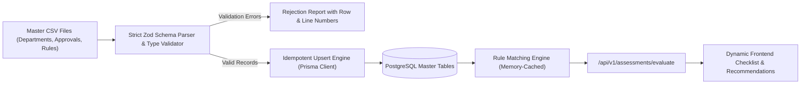

# CSV Ingestion Pipeline & Approval Rule Engine Specification
## SIH26130: Industrial Approval, Compliance and Government Support Navigator

---

## 1. Architectural Philosophy: Decoupled Rule Engine

Government policies, statutory acts, thresholds, and checklists evolve over time (e.g., changes in Maharashtra Industrial Policy, revisions to MPCB categorization, or new Ease of Doing Business notifications).

To ensure that the application remains maintainable, compliant, and extensible:
1. **Zero Hardcoded Logic in Frontend:** The React frontend never hard-codes statutory rules like "if workers > 10 trigger Factory License". The frontend solely submits business parameters and displays the evaluated recommendations returned by the API.
2. **Database-Driven Rule Store:** All approvals, departments, document requirements, and rule triggers reside in PostgreSQL tables (`departments`, `approvals`, `approval_rules`).
3. **Continuous CSV Ingestion:** Non-technical domain experts or government administrators can update or expand approval regulations by supplying standard CSV files, which are validated and safely ingested via the ingestion pipeline.

---

## 2. Ingestion Pipeline Flow



---

## 3. CSV File Specifications & Schemas

### A. Departments Master (`departments_master.csv`)
Defines the governing authorities and statutory SLA defaults.

| Header | Type | Required | Description & Validation |
| :--- | :--- | :--- | :--- |
| `code` | String | Yes | Unique department code (e.g. `MPCB`, `MIDC`, `DISH`) |
| `name` | String | Yes | Full English title |
| `name_marathi` | String | No | Official Marathi localized name |
| `description` | String | No | Functional mandate of the authority |
| `portal_url` | URL | No | Official online portal link |
| `nodal_officer_email` | Email | No | Contact email for escalation |
| `sla_working_days` | Integer | Yes | Default SLA working days under Maharashtra RTS Act |

---

### B. Approvals Master (`approvals_master_template.csv`)
Defines the statutory permissions, licenses, and document mappings.

| Header | Type | Required | Description & Validation |
| :--- | :--- | :--- | :--- |
| `approval_code` | String | Yes | Unique statutory code (e.g. `MPCB_CTE`, `DISH_FACT_LIC`) |
| `department_code` | String | Yes | Foreign key to `departments_master.csv` |
| `name` | String | Yes | Full approval title |
| `name_marathi` | String | No | Marathi title |
| `stage` | Enum | Yes | `PRE_ESTABLISHMENT`, `PRE_OPERATION`, `OPERATIONAL` |
| `category` | String | Yes | `NOC`, `LICENCE`, `REGISTRATION`, `PERMISSION` |
| `description` | String | Yes | Scope and applicability summary |
| `statutory_act` | String | Yes | Legal basis (e.g. Water Act 1974, Factories Act 1948) |
| `statutory_timeline_days` | Integer | Yes | Legally mandated turnaround time |
| `validity_period_months` | Integer | No | Validity duration (null if perpetual) |
| `renewal_required` | Boolean | Yes | `true` or `false` |
| `required_doc_codes` | String | Yes | Quoted, comma-separated list of document codes |
| `fee_structure_details` | String | No | Regulatory fee formula or slab summary |
| `external_portal_link` | URL | No | Direct departmental filing link |

---

### C. Approval Rules Master (`approval_rules_template.csv`)
Defines the deterministic predicates that trigger an approval.

| Header | Type | Required | Description & Validation |
| :--- | :--- | :--- | :--- |
| `rule_code` | String | Yes | Unique rule code (e.g. `RULE_DISH_FACTORY`) |
| `approval_code` | String | Yes | Foreign key to `approvals_master_template.csv` |
| `rule_name` | String | Yes | Human-readable condition title |
| `priority` | Integer | Yes | Execution priority (lower number evaluated first) |
| `conditions_json` | JSON | Yes | Structured condition tree (explained below) |
| `explanation_tpl` | String | Yes | Template with `{fieldName}` variable placeholders |

---

## 4. Rule Condition JSON Syntax

Conditions can be simple field checks or composite trees (`and`, `or`, `not`):

### 1. Leaf Comparison
```json
{
  "field": "pollutionCategory",
  "operator": "in",
  "value": ["RED", "ORANGE", "GREEN"]
}
```

### 2. Compound "AND" Condition
```json
{
  "and": [
    { "field": "employeeCount", "operator": ">=", "value": 10 },
    { "field": "powerRequirementKva", "operator": ">", "value": 0 }
  ]
}
```

### 3. Compound "OR" Condition
```json
{
  "or": [
    { "field": "builtUpAreaSqm", "operator": ">=", "value": 500 },
    { "field": "pollutionCategory", "operator": "in", "value": ["RED", "ORANGE"] }
  ]
}
```

### Supported Operators:
- `==`: Strict equality
- `!=`: Inequality
- `>`, `>=`, `<`, `<=`: Numeric comparisons
- `in`, `not_in`: Array membership
- `contains`: Substring matching

---

## 5. Idempotent Ingestion Execution

To run the ingestion pipeline:
```bash
cd server
npm run db:import-csv
```

The importer script executes `prisma.model.upsert`:
- If an approval or rule already exists (`rule_code` matches), it **updates** the metadata, conditions, and templates without altering historical application IDs.
- If it is new, it inserts the record.
- If an existing application has already referenced an approval, referential integrity (`ON DELETE RESTRICT` / `ON DELETE CASCADE`) prevents orphaned records.
