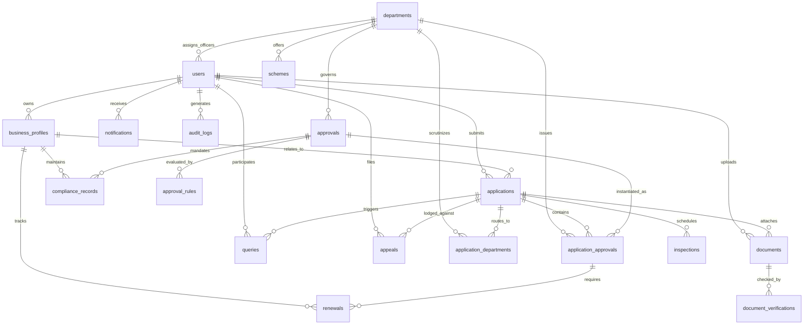

# Database Architecture & Entity-Relationship Design
## SIH26130: Industrial Approval, Compliance and Government Support Navigator

This document details the PostgreSQL schema designed for Prisma ORM, covering all 17 core entities required for single-window industrial approval, parallel departmental processing, and compliance management.

---

## 1. Entity-Relationship Diagram

---

## 2. Table Dictionary & Schema Specifications

### 1. `users`
Stores system accounts for citizens, government officers, and system administrators.

| Column | Type | Constraints | Description |
| :--- | :--- | :--- | :--- |
| `id` | UUID | PRIMARY KEY | Unique account identifier |
| `email` | VARCHAR(255) | UNIQUE, NOT NULL | Account email address (login credential) |
| `password_hash` | VARCHAR(255) | NOT NULL | Salted bcrypt hash |
| `full_name` | VARCHAR(255) | NOT NULL | User's full legal name |
| `phone` | VARCHAR(20) | UNIQUE, NOT NULL | Verified mobile number |
| `role` | ENUM | NOT NULL, DEFAULT 'CITIZEN' | `CITIZEN`, `OFFICER`, `ADMIN` |
| `is_active` | BOOLEAN | DEFAULT TRUE | Account operational status |
| `department_id` | UUID | NULLABLE, FK -> `departments(id)` | Assigned department for officers |
| `designation` | VARCHAR(100) | NULLABLE | Officer title (e.g. Sub-Regional Officer) |
| `created_at` | TIMESTAMPTZ | DEFAULT NOW() | Account registration timestamp |
| `updated_at` | TIMESTAMPTZ | ON UPDATE NOW() | Account update timestamp |

---

### 2. `business_profiles`
Captures all physical, financial, location, and environmental parameters of the enterprise.

| Column | Type | Constraints | Description |
| :--- | :--- | :--- | :--- |
| `id` | UUID | PRIMARY KEY | Unique business profile ID |
| `user_id` | UUID | NOT NULL, FK -> `users(id)` | Owner user account |
| `business_name` | VARCHAR(255) | NOT NULL | Registered business name |
| `legal_entity_type` | ENUM | NOT NULL | Proprietorship, LLP, Pvt Ltd, etc. |
| `industry_sector` | VARCHAR(100) | NOT NULL | Sector (Chemical, IT, Textile, etc.) |
| `nic_code` | VARCHAR(20) | NULLABLE | National Industrial Classification code |
| `business_activity` | TEXT | NOT NULL | Specific manufacturing or service description |
| `district` | VARCHAR(100) | NOT NULL | District in Maharashtra (e.g. Pune, Thane) |
| `taluka` | VARCHAR(100) | NOT NULL | Sub-district / Taluka |
| `pin_code` | VARCHAR(10) | NOT NULL | Postal index code |
| `is_midc_area` | BOOLEAN | DEFAULT FALSE | Located inside MIDC industrial estate |
| `midc_estate_name` | VARCHAR(150) | NULLABLE | Estate name (e.g. Chakan Phase II) |
| `survey_plot_number` | VARCHAR(100) | NULLABLE | Plot / Survey number |
| `land_area_sqm` | DECIMAL(12,2) | NOT NULL | Total land plot area in square meters |
| `built_up_area_sqm` | DECIMAL(12,2) | NOT NULL | Total proposed built-up factory area |
| `investment_plant_machinery` | DECIMAL(14,2) | NOT NULL | Investment in plant & machinery (INR) |
| `investment_land_building` | DECIMAL(14,2) | NOT NULL | Investment in land & civil works (INR) |
| `annual_turnover` | DECIMAL(14,2) | NULLABLE | Projected or actual annual revenue |
| `employeeCount` | INT | NOT NULL | Total anticipated workforce |
| `power_requirement_kva` | DECIMAL(10,2) | NOT NULL | Sanctioned power demand (kVA/HP) |
| `water_requirement_kld` | DECIMAL(10,2) | NOT NULL | Daily water demand in Kilo Litres/Day |
| `water_source` | VARCHAR(100) | NULLABLE | MIDC supply, Groundwater, Surface, Tanker |
| `pollution_category` | ENUM | NOT NULL | `RED`, `ORANGE`, `GREEN`, `WHITE`, `NOT_APPLICABLE` |
| `effluent_discharge_kld` | DECIMAL(10,2) | DEFAULT 0 | Industrial wastewater volume |
| `hazardous_waste_generation` | BOOLEAN | DEFAULT FALSE | Produces schedule-notified hazardous waste |
| `has_boiler` | BOOLEAN | DEFAULT FALSE | Utilizes steam boilers on premises |
| `boiler_capacity_tph` | DECIMAL(8,2) | NULLABLE | Boiler capacity (Tonnes per hour) |
| `has_dg_set` | BOOLEAN | DEFAULT FALSE | Operates standby diesel generator |
| `dg_set_capacity_kva` | DECIMAL(10,2) | NULLABLE | DG set capacity in kVA |
| `gst_registered` | BOOLEAN | DEFAULT FALSE | Holds GST registration |
| `gstin` | VARCHAR(20) | NULLABLE | 15-character GSTIN |
| `msme_registered` | BOOLEAN | DEFAULT FALSE | Registered under Udyam |
| `udyam_number` | VARCHAR(30) | NULLABLE | Udyam Registration Number |

---

### 3. `applications`
Master application representing the citizen's single-window clearance submission.

| Column | Type | Constraints | Description |
| :--- | :--- | :--- | :--- |
| `id` | UUID | PRIMARY KEY | Application ID |
| `user_id` | UUID | NOT NULL, FK -> `users(id)` | Applicant citizen ID |
| `business_profile_id`| UUID | NOT NULL, FK -> `business_profiles(id)` | Associated business profile |
| `application_number` | VARCHAR(50) | UNIQUE, NOT NULL | Official tracking reference (e.g. MH-NAV-2026-001) |
| `stage` | ENUM | NOT NULL | `DRAFT`, `SUBMITTED`, `UNDER_SCRUTINY`, `INSPECTION_SCHEDULED`, `APPROVED`, `REJECTED` |
| `overall_progress` | INT | DEFAULT 0 | Percentage completed (0 - 100%) |
| `project_stage` | ENUM | NOT NULL | `PRE_ESTABLISHMENT`, `PRE_OPERATION`, `OPERATIONAL` |
| `total_approvals_count`| INT | DEFAULT 0 | Total statutory approvals in application |
| `approved_count` | INT | DEFAULT 0 | Approvals sanctioned |
| `rejected_count` | INT | DEFAULT 0 | Approvals rejected |
| `query_pending_count` | INT | DEFAULT 0 | Active clarification queries |
| `submitted_at` | TIMESTAMPTZ | NULLABLE | Submission timestamp |
| `target_completion_date`| TIMESTAMPTZ | NULLABLE | Max SLA date computed across departments |

---

### 4. `departments`
Master record of participating government departments and authorities.

| Column | Type | Constraints | Description |
| :--- | :--- | :--- | :--- |
| `id` | UUID | PRIMARY KEY | Department ID |
| `code` | VARCHAR(20) | UNIQUE, NOT NULL | Code (MPCB, MIDC, DISH, FIRE, MSEDCL, REVENUE) |
| `name` | VARCHAR(255) | NOT NULL | Official Department Name |
| `name_marathi` | VARCHAR(255) | NULLABLE | Marathi localized name |
| `sla_working_days` | INT | DEFAULT 30 | Standard SLA working days under Maharashtra RTS Act |

---

### 5. `approvals`
Master catalog of statutory approvals, permissions, and licenses.

| Column | Type | Constraints | Description |
| :--- | :--- | :--- | :--- |
| `id` | UUID | PRIMARY KEY | Approval ID |
| `department_id` | UUID | NOT NULL, FK -> `departments(id)` | Issuing authority |
| `approval_code` | VARCHAR(50) | UNIQUE, NOT NULL | e.g. `MPCB_CTE`, `DISH_FACT_LIC`, `FIRE_PROVISIONAL_NOC` |
| `name` | VARCHAR(255) | NOT NULL | Formal approval title |
| `stage` | ENUM | NOT NULL | `PRE_ESTABLISHMENT`, `PRE_OPERATION`, `OPERATIONAL` |
| `category` | VARCHAR(50) | NOT NULL | NOC, LICENCE, REGISTRATION, PERMISSION |
| `statutory_act` | VARCHAR(255) | NOT NULL | Governing statutory legislation |
| `statutory_timeline_days` | INT | NOT NULL | Right to Public Services Act guarantee (days) |
| `renewal_required` | BOOLEAN | DEFAULT FALSE | Requires periodic renewal |
| `required_doc_codes` | TEXT[] | NOT NULL | Array of required document codes |

---

### 6. `approval_rules`
Predicate definitions for the deterministic rule matching engine.

| Column | Type | Constraints | Description |
| :--- | :--- | :--- | :--- |
| `id` | UUID | PRIMARY KEY | Rule ID |
| `approval_id` | UUID | NOT NULL, FK -> `approvals(id)` | Target approval triggered |
| `rule_code` | VARCHAR(50) | UNIQUE, NOT NULL | Unique rule identifier |
| `rule_name` | VARCHAR(255) | NOT NULL | Human-readable rule title |
| `conditions_json` | JSONB | NOT NULL | Structured logical condition tree |
| `priority` | INT | DEFAULT 100 | Evaluation order |
| `explanation_tpl` | TEXT | NOT NULL | Dynamic template for regulatory explanation |

---

### 7. `application_approvals`
Tracks the specific state of each required statutory approval for an application.

| Column | Type | Constraints | Description |
| :--- | :--- | :--- | :--- |
| `id` | UUID | PRIMARY KEY | Application approval ID |
| `application_id` | UUID | NOT NULL, FK -> `applications(id)` | Parent application |
| `approval_id` | UUID | NOT NULL, FK -> `approvals(id)` | Target approval |
| `department_id` | UUID | NOT NULL, FK -> `departments(id)` | Department managing clearance |
| `status` | ENUM | DEFAULT 'NOT_STARTED' | `NOT_STARTED`, `APPLIED`, `IN_PROGRESS`, `QUERY_RAISED`, `INSPECTION_PENDING`, `APPROVED`, `REJECTED` |
| `trigger_reason` | TEXT | NOT NULL | Specific legal rationale determined by engine |
| `sla_deadline` | TIMESTAMPTZ | NULLABLE | Statutory deadline date |
| `certificate_url` | VARCHAR(500) | NULLABLE | Link to issued digital certificate |
| `certificate_number`| VARCHAR(100) | NULLABLE | Sanction order reference number |

---

### 8. `documents`
Uploaded digital certificates, drawings, and supporting records.

| Column | Type | Constraints | Description |
| :--- | :--- | :--- | :--- |
| `id` | UUID | PRIMARY KEY | Document ID |
| `user_id` | UUID | NOT NULL, FK -> `users(id)` | Owning citizen |
| `application_id` | UUID | NULLABLE, FK -> `applications(id)` | Attached application |
| `document_type_code`| VARCHAR(50) | NOT NULL | e.g. `DOC_7_12`, `DOC_PAN`, `DOC_PROJECT_REPORT` |
| `document_name` | VARCHAR(255) | NOT NULL | Display name |
| `file_url` | VARCHAR(500) | NOT NULL | Path / Object storage URL |
| `file_size` | INT | NOT NULL | File size in bytes |
| `mime_type` | VARCHAR(100) | NOT NULL | e.g. `application/pdf` |
| `file_hash` | VARCHAR(64) | NOT NULL | SHA-256 cryptographic hash |
| `is_wallet_item` | BOOLEAN | DEFAULT FALSE | Saved in user's persistent verified wallet |
| `is_verified` | BOOLEAN | DEFAULT FALSE | Verified by AI or Officer |

---

### 9. `document_verifications`
Audit and status of AI or manual scrutiny conducted on uploaded documents.

| Column | Type | Constraints | Description |
| :--- | :--- | :--- | :--- |
| `id` | UUID | PRIMARY KEY | Verification record ID |
| `document_id` | UUID | NOT NULL, FK -> `documents(id)` | Target document |
| `verified_by_type` | ENUM | DEFAULT 'AI_AUTO' | `AI_AUTO` or `OFFICER_MANUAL` |
| `officer_id` | UUID | NULLABLE, FK -> `users(id)` | Scrutinizing officer if manual |
| `verification_status`| ENUM | NOT NULL | `PENDING`, `PASSED`, `FAILED`, `WARNING` |
| `confidence_score` | DECIMAL(5,2) | NULLABLE | AI classification confidence (0-100%) |
| `ai_extracted_data` | JSONB | NULLABLE | Parsed attributes (Name, GST, Plot, etc.) |
| `verification_notes`| TEXT | NULLABLE | Scrutiny remarks |

---

### 10. `application_departments`
Enables parallel departmental processing of a single application.

| Column | Type | Constraints | Description |
| :--- | :--- | :--- | :--- |
| `id` | UUID | PRIMARY KEY | Mapping ID |
| `application_id` | UUID | NOT NULL, FK -> `applications(id)` | Parent application |
| `department_id` | UUID | NOT NULL, FK -> `departments(id)` | Department reviewing slice |
| `assigned_officer_id`| UUID | NULLABLE, FK -> `users(id)` | Assigned desk officer |
| `overall_status` | ENUM | DEFAULT 'NOT_STARTED' | Department-level progress |
| `sla_due_date` | TIMESTAMPTZ | NULLABLE | Department-specific statutory deadline |

---

### 11. `inspections`
Common joint inspection management across departments.

| Column | Type | Constraints | Description |
| :--- | :--- | :--- | :--- |
| `id` | UUID | PRIMARY KEY | Inspection ID |
| `application_id` | UUID | NOT NULL, FK -> `applications(id)` | Target industrial project |
| `department_ids` | TEXT[] | NOT NULL | Participating departments (e.g. MPCB, DISH) |
| `inspection_type` | ENUM | DEFAULT 'JOINT_COMMON_INSPECTION' | Joint vs. individual |
| `scheduled_date` | TIMESTAMPTZ | NOT NULL | Inspection appointment timestamp |
| `status` | ENUM | NOT NULL | `SCHEDULED`, `COMPLETED`, `RESCHEDULED`, `CANCELLED` |
| `lead_officer_id` | UUID | NULLABLE, FK -> `users(id)` | Lead conducting officer |
| `site_address` | TEXT | NOT NULL | Physical industrial location |
| `findings_report_url`| VARCHAR(500) | NULLABLE | Uploaded joint inspection report |

---

### 12. `schemes`
Catalog of Maharashtra industrial subsidies, incentives, and package schemes.

| Column | Type | Constraints | Description |
| :--- | :--- | :--- | :--- |
| `id` | UUID | PRIMARY KEY | Scheme ID |
| `department_id` | UUID | NULLABLE, FK -> `departments(id)` | Sponsoring department |
| `scheme_code` | VARCHAR(50) | UNIQUE, NOT NULL | e.g. `MH_PSI_2019_MSME` |
| `scheme_name` | VARCHAR(255) | NOT NULL | Scheme title |
| `eligible_sectors` | TEXT[] | NOT NULL | Whitelisted sectors |
| `eligible_districts`| TEXT[] | NOT NULL | Whitelisted district categories (A, B, C, D, D+) |
| `subsidy_percentage`| DECIMAL(5,2) | NULLABLE | Fiscal subsidy percentage |
| `benefits_description`| TEXT | NOT NULL | Summary of incentives |
| `eligibility_criteria_json`| JSONB | NOT NULL | Formal rule criteria for incentive matching |

---

### 13. `compliance_records`
Ongoing post-establishment statutory compliance calendar.

| Column | Type | Constraints | Description |
| :--- | :--- | :--- | :--- |
| `id` | UUID | PRIMARY KEY | Compliance ID |
| `business_profile_id`| UUID | NOT NULL, FK -> `business_profiles(id)` | Target industrial unit |
| `approval_id` | UUID | NULLABLE, FK -> `approvals(id)` | Parent statutory license |
| `compliance_title` | VARCHAR(255) | NOT NULL | e.g. Annual Hazardous Waste Return (Form 4) |
| `frequency` | ENUM | NOT NULL | `MONTHLY`, `QUARTERLY`, `HALF_YEARLY`, `ANNUAL` |
| `next_due_date` | TIMESTAMPTZ | NOT NULL | Calendar due date |
| `status` | ENUM | NOT NULL | `COMPLIANT`, `UPCOMING`, `OVERDUE` |

---

### 14. `renewals`
Automated alerts and filings for expiring statutory approvals.

| Column | Type | Constraints | Description |
| :--- | :--- | :--- | :--- |
| `id` | UUID | PRIMARY KEY | Renewal tracking ID |
| `application_approval_id`| UUID | NOT NULL, FK -> `application_approvals(id)` | Approval to renew |
| `business_profile_id`| UUID | NOT NULL, FK -> `business_profiles(id)` | Target business |
| `expiry_date` | TIMESTAMPTZ | NOT NULL | Approval expiration date |
| `renewal_window_days`| INT | DEFAULT 60 | Days before expiry renewal window opens |
| `renewal_status` | ENUM | NOT NULL | `VALID`, `DUE_SOON`, `OVERDUE`, `RENEWAL_FILED` |

---

### 15. `notifications`
Multi-channel alerts for citizens and officers (SLA warnings, queries, inspections).

| Column | Type | Constraints | Description |
| :--- | :--- | :--- | :--- |
| `id` | UUID | PRIMARY KEY | Notification ID |
| `user_id` | UUID | NOT NULL, FK -> `users(id)` | Recipient user |
| `title` | VARCHAR(255) | NOT NULL | Short alert title |
| `message` | TEXT | NOT NULL | Alert details |
| `type` | ENUM | NOT NULL | `STATUS_UPDATE`, `QUERY`, `SLA_WARNING`, `INSPECTION`, `RENEWAL` |
| `is_read` | BOOLEAN | DEFAULT FALSE | Read indicator |

---

### 16. `queries`
Direct bidirectional query-response loop between Department Officers and Citizens.

| Column | Type | Constraints | Description |
| :--- | :--- | :--- | :--- |
| `id` | UUID | PRIMARY KEY | Query ID |
| `application_id` | UUID | NOT NULL, FK -> `applications(id)` | Target application |
| `application_approval_id`| UUID | NULLABLE, FK -> `application_approvals(id)` | Specific approval query |
| `department_id` | UUID | NOT NULL, FK -> `departments(id)` | Raising department |
| `officer_id` | UUID | NOT NULL, FK -> `users(id)` | Officer raising query |
| `citizen_id` | UUID | NOT NULL, FK -> `users(id)` | Applicant responding |
| `query_subject` | VARCHAR(255) | NOT NULL | Summary topic |
| `query_description` | TEXT | NOT NULL | Detailed clarification sought |
| `officer_attachments`| TEXT[] | NOT NULL | Evidence files uploaded by officer |
| `citizen_response` | TEXT | NULLABLE | Citizen's clarification answer |
| `citizen_attachments`| TEXT[] | NOT NULL | Revised documents uploaded by citizen |
| `status` | ENUM | DEFAULT 'OPEN' | `OPEN`, `RESPONDED`, `RESOLVED` |

---

### 17. `audit_logs`
Immutable compliance and security ledger.

| Column | Type | Constraints | Description |
| :--- | :--- | :--- | :--- |
| `id` | UUID | PRIMARY KEY | Log ID |
| `user_id` | UUID | NULLABLE, FK -> `users(id)` | User who triggered action |
| `user_role` | VARCHAR(50) | NULLABLE | Role of user at event time (`CITIZEN`, `OFFICER`, `ADMIN`) |
| `action` | VARCHAR(100) | NOT NULL | `LOGIN`, `SUBMIT_APP`, `APPROVE`, `REJECT`, `RAISE_QUERY`, `VERIFY_DOC`, `CREATE_RULE`, `USER_ACTIVATED`, `STATUTORY_APPEAL_FILED`, `APPELLATE_ORDER_*` |
| `entity_name` | VARCHAR(50) | NOT NULL | `APPLICATION`, `DOCUMENT`, `USER`, `RULE`, `APPEAL` |
| `entity_id` | VARCHAR(100) | NULLABLE | ID of target entity |
| `ip_address` | VARCHAR(45) | NULLABLE | Remote IP address |
| `user_agent` | VARCHAR(255) | NULLABLE | Client browser user agent |
| `details_json` | JSONB | NULLABLE | Snapshot of state changes with PII masking |
| `created_at` | TIMESTAMPTZ | DEFAULT NOW() | Timestamp of event |

---

### 18. `appeals`
Statutory grievance filings under Maharashtra Right to Public Services Act (RTS 2015) Section 18.

| Column | Type | Constraints | Description |
| :--- | :--- | :--- | :--- |
| `id` | UUID | PRIMARY KEY | Appeal unique identifier |
| `appeal_number` | VARCHAR(50) | UNIQUE, NOT NULL | Docket identifier (e.g. `MH-RTS-APP-2026-1045`) |
| `application_id` | UUID | NOT NULL, FK -> `applications(id)` | Associated single-window application |
| `citizen_id` | UUID | NOT NULL, FK -> `users(id)` | Applicant citizen filing appeal |
| `department_code` | VARCHAR(20) | NOT NULL | Respondent department (e.g. `MPCB`, `DISH`) |
| `appellate_authority` | ENUM | NOT NULL, DEFAULT 'FIRST_APPELLATE' | `FIRST_APPELLATE` (Joint Director), `SECOND_APPELLATE` (Principal Secretary) |
| `ground_for_appeal` | ENUM | NOT NULL | `SLA_BREACH`, `REJECTION_WITHOUT_REASON`, `UNREASONABLE_QUERY`, `CORRUPTION_HARASSMENT`, `OTHER` |
| `applicant_statement` | TEXT | NOT NULL | Citizen legal grievance petition statement |
| `status` | ENUM | NOT NULL, DEFAULT 'PENDING' | `PENDING`, `HEARING_SCHEDULED`, `UPHELD`, `DIRECTED_CLEARANCE`, `DISMISSED` |
| `officer_remarks` | TEXT | NULLABLE | Statutory findings and legal disposal order reason |
| `hearing_date` | TIMESTAMPTZ | NULLABLE | Formal hearing date scheduled by authority |
| `order_document_url` | VARCHAR(500) | NULLABLE | Digitally signed appellate order document |
| `decided_at` | TIMESTAMPTZ | NULLABLE | Timestamp of final disposal order |
| `decided_by` | VARCHAR(255) | NULLABLE | Name & title of deciding appellate officer |
| `created_at` | TIMESTAMPTZ | DEFAULT NOW() | Appeal docketing timestamp |
| `updated_at` | TIMESTAMPTZ | ON UPDATE NOW() | Docket status update timestamp |

