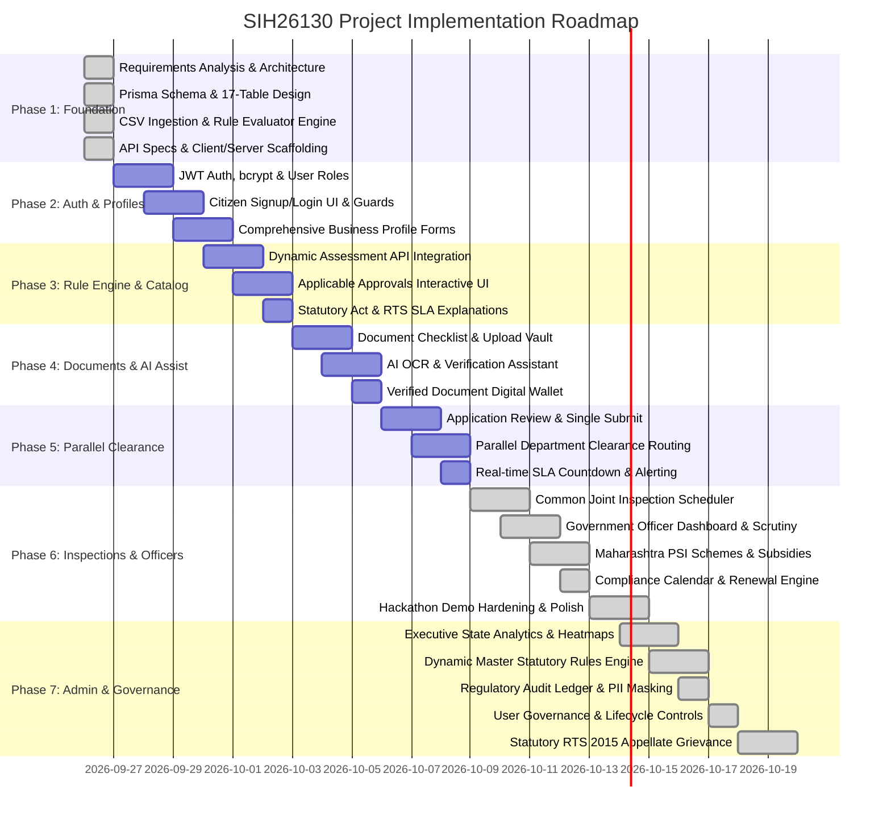

# Phased Development Roadmap
## SIH26130: Industrial Approval, Compliance and Government Support Navigator

---

## 1. Development Phases & Milestones

---

## 2. Phase Breakdown & Deliverables

### Phase 1: Technical Foundation & Architecture (Current Phase - Completed)
- [x] Comprehensive requirements analysis for SIH26130.
- [x] Unified folder structure (`client`, `server`, `docs`, `data`).
- [x] PostgreSQL database design with Prisma ORM encompassing all 17 entities.
- [x] CSV data ingestion pipeline and sample templates for Maharashtra departments, approvals, and rules.
- [x] Deterministic statutory rule matching engine with JSON predicate trees.
- [x] REST API architecture and OpenAPI/REST contracts.
- [x] Vite + React + Tailwind + TypeScript client scaffolding with auth guards and route stubs.

---

### Phase 2: Core Authentication, Security & Business Profile Engine
- Implement `POST /api/v1/auth/signup` and `POST /api/v1/auth/login` with bcrypt and JWT tokens.
- Build frontend Signup and Login forms with form validation and error handling.
- Verify that unauthenticated users cannot access `/start-assessment` or protected pages.
- Build multi-step Business Profile form capturing enterprise financials, plant & machinery, location, power, water, and environmental parameters.

---

### Phase 3: Smart Assessment & Statutory Approval Recommendations
- Connect the business profile with `POST /api/v1/assessments/evaluate`.
- Render the Applicable Approvals list with department badges, statutory act citations, RTS timelines, and dynamic legal justifications.
- Generate consolidated required documents checklist, deduplicating requirements across departments.

---

### Phase 4: Document Vault, AI Verification & Verified Wallet
- Implement secure file upload with MIME/size checking and SHA-256 integrity hashing.
- Integrate lightweight AI assistant for OCR classification and field consistency verification.
- Implement the "Verified Document Wallet" enabling one-click attachment across multiple statutory filings.

---

### Phase 5: Single-Window Submission, Parallel Processing & SLA Tracker
- Implement consolidated application submission (`POST /api/v1/applications/:id/submit`).
- Route clearances concurrently to respective department queues (MPCB, DISH, MIDC, Fire, etc.).
- Build visual SLA progress bar showing Maharashtra Right to Public Services Act countdowns with overdue escalation warnings.

---

### Phase 6: Common Inspections, Schemes, Officer Portal & Final Polish
- Common Joint Inspection scheduler synchronizing field visits across departments.
- Government Officer Dashboard for scrutinizing documents, raising queries, and approving applications.
- Maharashtra Package Scheme of Incentives (PSI) eligibility matcher.
- Post-approval compliance calendar and automated license renewal tracker.

---

### Phase 7: State Administration, Regulatory Audit Ledger, Performance Analytics & Statutory RTS Appellate Grievance Portal
- [x] Executive State Performance Analytics: aggregate state investments, employment, cross-department RTS rankings, SLA compliance rates, and district industrial Capex heatmaps.
- [x] Dynamic Statutory Master Rules Engine: schema validation, dynamic JSON predicate rule injection, priority management, and live evaluation.
- [x] Regulatory Audit Trail Explorer: tamper-proof event logging with client IP tracking, action/entity filtering, and PII masking for sensitive citizen identifiers.
- [x] User Governance & Role Management: operational lifecycle controls (Active/Suspended status toggle) with audit trail emission.
- [x] Maharashtra Right to Public Services Act (RTS 2015) Statutory Appeals Mechanism: Section 18 citizen appeal filing, First Appellate Authority (Joint Director of Industries) and Second Appellate Authority (Principal Secretary) tiering, docket tracking, and legally binding appellate disposal orders (`DIRECTED_CLEARANCE`, `UPHELD`, `DISMISSED`) auto-updating clearance states.
- [x] Dedicated Frontend State Control Center (`/admin/dashboard`) and Citizen RTS Grievance Desk on (`/sla-tracker`).
- [x] Automated Test Suite: 14 comprehensive end-to-end scenarios (`npm run test:phase7`).

